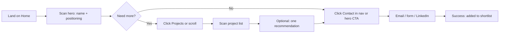
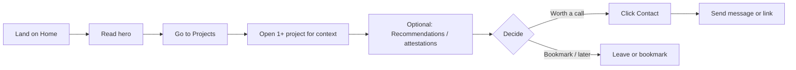

# UX Design Specification - Michelle Portfolio

**Author:** Nawid
**Date:** 2026-02-24

---

## Executive Summary

### Project Vision

A single professional portfolio for Christy Sebastini that replaces scattered links and documents with one cohesive, reference-tier presence. Visitors (recruiters, hiring managers, potential clients) quickly understand who she is, see proof of experience and credibility, and can reach her—without confusion or dead ends. The experience balances fast scan (recruiter) with deeper exploration (hiring manager), and supports optional 3D/motion and strong visual hierarchy within accessibility and performance constraints.

### Target Users

- **Recruiters / HR (primary):** Time-poor; need "who she is, what she's done, can I trust it?" and a clear Contact/CTA in under a minute. Often on mobile or shared links.
- **Hiring managers / potential clients (primary):** Want context, role, and outcomes per project; may open recommendations or attestations. Need enough evidence to decide "worth a call" or "bookmark for later."
- **Christy (site owner):** Wants the site to stay current; MVP = manual updates by you; Growth = optional CMS or structured content flow.

### Key Design Challenges

- **First-screen clarity:** Hero and hierarchy must answer "who + what + trust" quickly for recruiters.
- **Two modes in one site:** Support both fast scan and deeper project/recommendation exploration without overwhelming or hiding the CTA.
- **Reference-tier + inclusive:** Strong layout and optional 3D/motion must not block content; respect reduced motion and WCAG 2.1 AA.

### Design Opportunities

- **3D/motion:** Use for hero or key sections to differentiate while keeping core content and performance safe.
- **Information architecture:** Clear, consistent nav and sections so "Projects," "Recommendations," and "Contact" are obvious from any page.
- **Credibility in context:** Surface recommendations, attestations, and project assets (per PRD Assets inventory) where they support trust and depth.

## Core User Experience

### Defining Experience

The core action is: **visitors reach "I understand who Christy is and how to reach her"**—and optionally go deeper into projects and proof. For recruiters this is the primary loop (fast); for hiring managers it extends to "I have enough evidence to decide." The product’s value is delivering that understanding and the contact path without confusion or extra steps.

### Platform Strategy

- **Primary:** Web (responsive). Mobile-first; recruiters often open links on phone or tablet.
- **Input:** Touch and mouse/keyboard; CTAs and nav must work for both. Keyboard and screen-reader support per WCAG 2.1 AA.
- **No offline requirement.** Optional 3D/motion only where it doesn’t block core content; fallbacks for no-WebGL and reduced motion.

### Effortless Interactions

- **First screen:** Hero + one scroll answers "who" and "what" so the next step (Projects or Contact) is obvious.
- **Navigation:** "Projects," "Recommendations" (or Trust), and "Contact" are always available; Contact reachable in 2–3 clicks from any page.
- **No dead ends:** Every path leads to more context or to Contact; no "I still don’t know what she does."
- **Scan vs depth:** Same IA supports quick scan (list, headlines) and deeper dive (project detail, PDFs) without forcing one path.

### Critical Success Moments

- **First impression (0–30s):** "This looks serious and professional" — hierarchy and tone set trust.
- **Recruiter success:** "Who is she? What has she done? Can I trust it?" answered + CTA found without digging.
- **Hiring manager success:** Enough project context and proof (recommendations, attestations) to decide "worth a call" or "bookmark."
- **Failure to avoid:** Confusion about expertise, hidden Contact, or content that blocks or delays the core message.

### Experience Principles

1. **Clarity first.** Every screen prioritizes "who, what, and how to reach her"; decoration supports, never obscures.
2. **Two modes, one structure.** Support fast scan and deeper exploration with the same nav and sections; don’t force a single path.
3. **Credibility visible.** Recommendations, attestations, and project proof are findable where they matter (About, Projects, dedicated trust section).
4. **CTA never buried.** Contact/primary CTA is obvious from home and reachable from any section in 2–3 actions.
5. **Inclusive by default.** Layout, contrast, motion, and focus order work for keyboard and assistive tech; respect reduced motion.

## Desired Emotional Response

### Primary Emotional Goals

- **Confident and informed:** Visitors feel they have a clear picture of who Christy is and what she does—no guessing or second-guessing.
- **"This is serious and professional":** First impression reinforces trust; the site feels reference-tier, not generic or amateur.
- **Relieved and efficient:** Recruiters feel they've done a proper first screening without hunting for information; hiring managers feel they have enough to decide.
- **Willing to act:** By the time they see the CTA, they feel ready to contact or bookmark—not lost or skeptical.

### Emotional Journey Mapping

- **Discovery (first 5–10s):** Curiosity and slight expectation ("Is this worth my time?"). Design goal: immediate signal of quality and relevance.
- **Scan / core experience:** Confidence building as "who, what, trust" become clear; no confusion or frustration from hidden content or clutter.
- **After primary goal:** Satisfaction ("I got what I needed") and, for those going deeper, interest ("There's more here if I want it").
- **If something goes wrong:** Avoid anxiety or doubt (e.g. broken link, slow load). Design goal: clear feedback, fallbacks, no dead ends.
- **Returning:** Same clarity and trust; no "did something change?" confusion if content is updated.

### Micro-Emotions

- **Confidence over confusion:** Hierarchy and copy answer "who/what" quickly; no ambiguous or empty sections.
- **Trust over skepticism:** Proof (recommendations, attestations, projects) is visible and reachable; layout and tone feel professional.
- **Accomplishment over frustration:** Reaching Contact or deciding "worth a call" feels straightforward, not like a treasure hunt.
- **Light delight (optional):** Where 3D/motion is used, it should feel polished and intentional, not gimmicky or distracting.

### Design Implications

- **Trust:** Use clear typography, spacing, and structure; surface real names, roles, and documents (e.g. Anne-Claire Petitcol, attestations) so credibility is concrete.
- **Confidence:** Avoid vague or empty blocks; every section should add information. Clear labels (e.g. "Projects," "Recommendations," "Contact") reduce cognitive load.
- **Efficiency:** Persistent or obvious nav; primary CTA visible from home and repeated where it makes sense (e.g. end of Projects, About).
- **Delight (optional):** Motion and 3D only where they support the story (e.g. hero, key transition); never at the cost of clarity or performance.

### Emotional Design Principles

1. **Trust through clarity.** Every element should reinforce "this person is real, credible, and easy to reach."
2. **No anxiety.** No dead ends, no "loading forever," no hidden Contact; reduce motion for users who prefer it.
3. **Respect their time.** Prioritize the fastest path to "I understand and I can reach her" while offering depth for those who want it.
4. **One coherent tone.** Professional, warm, and consistent—so the emotional takeaway is "serious and human," not corporate or cold.

## UX Pattern Analysis & Inspiration

### Inspiring Products Analysis

Reference sites (catnipster.store, viessmann.fr, mawzi.com, newfooddata.com, proteinesxtc.com) set the bar for "reference-tier" presence:

- **Shared strengths:** Strong visual hierarchy; confident use of space and typography; clear primary action or value statement; modern, brand-led aesthetic without looking like a generic template.
- **Relevance to Christy's portfolio:** Recruiters and hiring managers expect a similar level of polish and clarity; these sites show how to feel premium and scannable at once.
- **Patterns to borrow:** Hero that states who/what quickly; nav that surfaces key sections (e.g. offer, projects, contact); consistent type scale and spacing; CTAs that are visible but not noisy; optional use of motion or 3D in hero/key moments without blocking content.

### Transferable UX Patterns

**Navigation:** Persistent or sticky nav with a small set of labels (e.g. Home, Projects, About/Experience, Contact); primary CTA (e.g. Contact / Open to work) in nav or hero. Supports "2–3 clicks to Contact" and fast scan.

**Hierarchy & layout:** One clear focal point above the fold (name + one-line positioning or hero message); supporting blocks (projects, proof) in clear sections. Supports "who + what + trust" in under a minute.

**Trust & proof:** Dedicated area or section for recommendations, attestations, or case proof; real names and roles where possible. Supports confidence and "this is serious."

**Visual tone:** Restrained palette, strong typography, generous spacing. Optional: subtle motion or 3D in hero only, with fallback. Supports "reference-tier" and "professional" without clutter.

### Anti-Patterns to Avoid

- **Cluttered hero:** Too many messages or CTAs above the fold; weak hierarchy. Undermines fast scan and confidence.
- **Buried or vague CTA:** Contact hidden in footer only, or labeled unclearly. Undermines "willing to act" and efficiency.
- **Heavy first load:** 3D or large motion blocking core content or LCP. Undermines performance and accessibility.
- **Generic portfolio template:** Same layout as every other portfolio with no clear voice or structure. Undermines "this is serious and professional."
- **Dead ends:** Pages or sections that don't lead to more context or Contact. Undermines trust and clarity.

### Design Inspiration Strategy

**Adopt:** Clear nav with Projects, Recommendations/Trust, Contact; hero that answers "who + what" in one glance; one primary CTA (Contact) visible from home and in nav; sectioned layout for projects and proof; real names and documents for credibility.

**Adapt:** Reference-tier visual language (typography, spacing, tone) applied to a single-person portfolio and to the full Assets inventory (PDFs, ViaMapa, photos); optional 3D/motion only where it adds to the story and doesn't block content or break reduced-motion.

**Avoid:** Cluttered hero; Contact only in footer; 3D/motion that delays or replaces core content; generic template look; pages with no path to Contact or deeper proof.

## Design System Foundation

### 1.1 Design System Choice

**shadcn/ui** (themeable, component-based system built on Radix UI + Tailwind CSS), as specified in the PRD tech stack.

### Rationale for Selection

- **PRD alignment:** Next.js, shadcn, Framer Motion, and GSAP are already chosen; shadcn provides the shared UI layer without locking in a heavy framework.
- **Reference-tier flexibility:** Components are copy-paste and themeable (tokens, typography, spacing), so we can match the reference sites' tone while keeping consistency and accessibility.
- **Accessibility:** Radix primitives give keyboard, focus, and screen-reader behavior; WCAG 2.1 AA is achievable for key flows.
- **Fit for portfolio:** Suits content-led pages (Home, About, Projects, Recommendations, Contact), nav, and CTAs without unnecessary complexity.
- **Team and maintenance:** Single developer or small team can ship and iterate quickly; no runtime design-system dependency.

### Implementation Approach

- Use shadcn components for nav, buttons, cards, and layout patterns; extend or compose where needed (e.g. project cards, recommendation blocks).
- Design tokens (colors, type scale, spacing) defined to support reference-tier hierarchy and emotional goals (clarity, trust).
- Optional 3D/motion (Three.js, Framer Motion, GSAP) used in hero or key sections only; shadcn handles the rest of the UI so core content stays fast and accessible.

### Customization Strategy

- **Tokens:** Align palette and type scale with reference sites and "serious and professional" tone; ensure contrast and touch targets.
- **Components:** Start from shadcn defaults; customize project list, recommendation/attestation blocks, and CTA treatment to match content and Assets.
- **Motion:** Use Framer Motion/GSAP for transitions and hero; respect `prefers-reduced-motion` and avoid blocking LCP.

## 2. Core User Experience (Defining Interaction)

### 2.1 Defining Experience

**The defining experience:** *"Land, get who she is and how to reach her—then go deeper if I want."*

The core interaction is the **first-screen scan + one clear path to Contact**. If that works (hero answers "who/what," nav and CTA are obvious, Contact is 2–3 clicks away), recruiters feel they’ve done a proper first screening and hiring managers know they can dig into projects next. This is the moment the product succeeds or fails.

### 2.2 User Mental Model

- **Recruiters:** "I have 50 applications; I need a quick yes/no on this person." They expect: name, role/positioning, proof (employers, projects), and a way to contact. Confusion or buried Contact = bounce.
- **Hiring managers:** "I need to see if her experience fits." They expect: clear sections (About, Projects, proof), optional depth (project detail, PDFs), and Contact when ready. They’re okay scrolling if structure is clear.
- **Current alternatives:** LinkedIn (no single “portfolio” page), PDF CV (static, no hierarchy), or no portfolio (weaker signal). The portfolio wins when it’s the one place that combines clarity, proof, and reach in one link.

### 2.3 Success Criteria

- **"This just works":** First screen + one scroll answer "who" and "what"; Contact is visible (nav or hero) and reachable in 2–3 clicks from anywhere.
- **Feeling accomplished:** Recruiter adds Christy to the shortlist; hiring manager decides "worth a call" or bookmarks—without hunting or guessing.
- **Feedback:** Clear hierarchy (no ambiguity), visible CTA, and optional confirmation (e.g. "Message sent" or "Link copied") so the user knows the action worked.

### 2.4 Novel UX Patterns

- **Mostly established:** Hero + nav + sections + CTA is a known pattern. No new interaction to teach.
- **Optional twist:** 3D or motion in hero/key sections for "reference-tier" feel; must not block content or LCP. Familiar layout with a distinctive layer.
- **Risk to avoid:** Novel for the sake of it (e.g. unusual nav or hidden Contact) would hurt the core experience.

### 2.5 Experience Mechanics

**1. Initiation:** User lands from LinkedIn, email, or direct link. Hero and first scroll are the trigger; no extra step to "start."

**2. Interaction:** User scans (read hero, maybe one scroll), then either clicks Contact/CTA or moves to Projects/About/Recommendations. Nav and CTA are the main controls; scrolling reveals sections.

**3. Feedback:** Clear typography and hierarchy signal "you’re in the right place"; section labels and CTA state (e.g. hover/focus) reinforce actions. If something fails (e.g. form), show a clear message.

**4. Completion:** Recruiter: "I have what I need and I know how to reach her." Hiring manager: "I’ve seen enough to decide" and can contact or bookmark. Next step is their choice (send message, open project, leave).

## Visual Design Foundation

### Color System

- **Direction:** Restrained, professional palette that supports trust and clarity. No brand guidelines were provided; align with reference sites (e.g. confident neutrals, one accent for CTAs and emphasis).
- **Semantic mapping:** Primary = CTA and key links (e.g. Contact); secondary = supporting actions; background/foreground with clear hierarchy; success/error for feedback (forms, messages). Use shadcn token names (primary, secondary, muted, accent) for consistency.
- **Accessibility:** All text/UI meets WCAG 2.1 AA contrast (4.5:1 body, 3:1 large text and UI). Avoid low-contrast decorative text for critical content.

### Typography System

- **Tone:** Professional, modern, readable. Supports "serious and professional" and scannable headings (recruiter) and comfortable body reading (hiring manager).
- **Scale:** Clear hierarchy—hero/name (largest), section titles (h2), subsections (h3), body, captions/small. Use a consistent scale (e.g. type scale 1.25 or 1.2) so hierarchy is obvious.
- **Pairing:** One strong sans for headings and UI; same or a complementary sans for body to keep load light and clarity high. No mandatory brand fonts; choose for readability and reference-tier feel.
- **Line height & spacing:** Comfortable line height for body (e.g. 1.5–1.6); tighter for large headings. Sufficient spacing between sections to support scan and depth.

### Spacing & Layout Foundation

- **Density:** Airy rather than dense—generous spacing between sections and around key blocks (hero, project cards, CTA) so the page breathes and hierarchy is clear.
- **Base unit:** 4px or 8px base grid; spacing scale (e.g. 4, 8, 16, 24, 32, 48, 64) for consistency. Align with shadcn/Tailwind conventions where possible.
- **Layout:** Single-column or simple multi-column for project grids; max-width for readability on large screens. Sticky or persistent nav; hero and CTA above the fold on mobile.

### Accessibility Considerations

- **Contrast:** All text and interactive elements meet WCAG 2.1 AA; check focus states and hover states for visibility.
- **Touch targets:** Buttons and links at least 44×44px where possible (especially nav and CTA on mobile).
- **Motion:** Respect `prefers-reduced-motion`; optional motion (hero, transitions) can be toned down or disabled. No motion-only critical information.
- **Focus:** Visible focus indicators for keyboard users; logical tab order (nav → main content → CTA).

## Design Direction Decision

### Design Directions Explored

An HTML showcase was created at `_bmad-output/planning-artifacts/ux-design-directions.html` with three directions:

- **Direction A — Minimal & airy:** Light typography, generous whitespace, hero with name + one-line positioning + CTA. Nav with primary CTA (Contact). Best for fast scan and "serious and professional" without visual noise.
- **Direction B — Bold typography & contrast:** Strong heading weight and size, nav with bottom border. Same content structure, heavier visual weight. Suits a more assertive brand tone.
- **Direction C — Card-led, section-heavy:** Centered hero plus a grid of project cards (e.g. Ubisoft, Transavia, ViaMapa) on the first view. Emphasizes "projects" immediately; good if recruiters should see company names at a glance.

### Chosen Direction

**Direction A (Minimal & airy)** is the recommended base: it aligns with "clarity first," fast scan, and reference-tier restraint. Direction B can be used for typographic emphasis (e.g. hero only); Direction C’s card grid can be adopted for the Projects section while keeping A’s hero and nav.

### Design Rationale

- Supports "who + what + trust" in under a minute with minimal cognitive load.
- Airy spacing and clear hierarchy support emotional goals (confidence, trust, no anxiety).
- Easy to add optional 3D/motion in the hero later without changing the overall direction.
- Nav + primary CTA pattern matches the "2–3 clicks to Contact" requirement.

### Implementation Approach

- Implement hero and global nav per Direction A (or hybrid with C’s project cards on the home or Projects page).
- Apply Visual Design Foundation tokens (typography, spacing, color) to the chosen direction.
- Use shadcn components for nav, buttons, and cards; customize to match the showcase.
- Review `ux-design-directions.html` in a browser to confirm or adjust before locking final UI.

## User Journey Flows

### Recruiter / HR (Primary – Fast scan to Contact)

**Goal:** Answer "Who is she? What has she done? Can I trust it?" and find Contact in under a minute.

**Entry:** Link from LinkedIn or application. **Key steps:** Hero answers who/what → Nav visible (Projects, Recommendations, Contact) → Contact in nav or hero CTA; optional detour to Projects or Recommendations. **Success:** CTA reached, recruiter has enough to shortlist. **Failure to avoid:** Unclear hero, buried Contact, too many clicks.

### Hiring Manager / Potential Client (Primary – Depth then Contact)

**Goal:** Get enough evidence (projects, context, proof) to decide "worth a call" or bookmark; then reach Contact if desired.

**Entry:** Link from colleague or LinkedIn. **Key steps:** Hero → Projects → project detail (context, role, outcome) → optional PDFs/recommendations → Contact or bookmark. **Success:** Enough evidence to decide; Contact obvious when ready. **Failure to avoid:** No project depth, dead ends, no clear CTA after reading.

### Christy (Site Owner – Content update)

**Goal:** New content (role, project, recommendation) is added and published; site stays consistent.

**Flow (MVP):** Christy sends you assets/copy → You update content (code or MD/JSON) → Deploy → Content appears in correct sections with same layout. **Success:** Live site reflects updates; she can share the link. **Growth:** Optional CMS or structured flow so she (or you) can edit, preview, and publish without code deploys.

### Journey Patterns

- **Navigation:** Persistent nav (Home, About, Projects, Recommendations, Contact) + primary CTA (Contact) in nav and/or hero. Same pattern on every page so both "scan" and "depth" users find their path.
- **Decisions:** "Need more?" (scroll or click Projects/Recommendations) and "Ready to contact?" (click CTA). No more than one or two meaningful decisions per journey.
- **Feedback:** Clear hierarchy (user knows where they are); CTA hover/focus state; optional form confirmation (e.g. "Message sent") or copy-link feedback.

### Flow Optimization Principles

- **Minimize steps to value:** Recruiter: hero + one click to Contact when possible; Hiring manager: Home → Projects → (detail) → Contact in 2–3 clicks.
- **Reduce cognitive load:** One primary CTA (Contact); section labels and nav labels unambiguous.
- **Clear progress:** Section structure and nav highlight current area; no dead-end pages.
- **Error recovery:** Broken links or failed form submit show clear message; 3D/motion fallback when unsupported so content still loads.

## Component Strategy

### Design System Components (shadcn/ui)

**Use as-is or lightly themed:** NavigationMenu / nav links, Button (primary CTA, secondary), Card (project cards, recommendation blocks), Separator, layout primitives. Typography via Tailwind/shadcn. Form components (Input, Label) for Contact form if needed. All support keyboard and focus; use design tokens from Visual Foundation.

### Custom Components

#### Hero

- **Purpose:** First-screen block that answers "who" and "what" and surfaces the primary CTA. Supports recruiter fast scan.
- **Usage:** Home page top; optional 3D/motion layer behind or beside content.
- **Anatomy:** Name (h1), one-line positioning (subtitle), optional short line, primary CTA (Contact). Optional visual (photo or 3D).
- **States:** Default; optional hover on CTA; reduced-motion variant (no animation).
- **Accessibility:** Semantic heading, CTA focusable; motion respects prefers-reduced-motion.

#### ProjectCard

- **Purpose:** One project or employer (e.g. Ubisoft, Transavia, ViaMapa) with title, optional thumbnail, short context, link to detail or PDF.
- **Usage:** Projects section list; optionally on home (Direction C style).
- **Anatomy:** Title, optional logo/image, role/period or one-line context, "View" or "Read more" link.
- **States:** Default, hover (optional lift or underline link), focus.
- **Accessibility:** Link or button has clear label; optional image has alt text.

#### RecommendationBlock / TrustBlock

- **Purpose:** Surface one recommendation or attestation (e.g. Anne-Claire Petitcol quote + link to PDF).
- **Usage:** Recommendations section or About; supports FR8–FR11.
- **Anatomy:** Quote or short excerpt, attributor (name, role), optional link to full PDF.
- **States:** Default; link hover/focus.
- **Accessibility:** Quote semantics; link text descriptive ("Read full recommendation").

#### ContactSection

- **Purpose:** Clear CTA and path to contact (email link, form, or LinkedIn).
- **Usage:** Dedicated Contact page or section; CTA in nav/hero can link here.
- **Anatomy:** Heading, primary action (e.g. "Email me", "Open form", "LinkedIn"), optional short copy.
- **States:** Default; form states if form (idle, submitting, success, error).
- **Accessibility:** Visible focus; form labels and error messages associated.

### Component Implementation Strategy

- Build custom components with shadcn tokens (colors, spacing, type) so they match the design system.
- Reuse shadcn Button, Card, and typography inside custom Hero, ProjectCard, RecommendationBlock, ContactSection.
- Ensure every custom component has keyboard support and clear focus; test with reduced motion.
- Optional 3D/motion in Hero implemented as a separate layer (e.g. canvas or wrapper) so content is still available if unsupported.

### Implementation Roadmap

- **Phase 1 (MVP):** Nav (shadcn or custom nav with CTA), Hero (custom), ProjectCard (custom using Card), RecommendationBlock (custom), ContactSection (custom + optional Form), layout and global styles. Enough to support Recruiter and Hiring manager journeys.
- **Phase 2:** Project detail page (content + optional PDF link), richer RecommendationBlock (e.g. multiple items), optional photo gallery or Assets integration.
- **Phase 3:** Optional 3D/motion in Hero, optional CMS-driven content for Christy, any enhancement components.

---

<!-- UX design content will be appended sequentially through collaborative workflow steps -->
